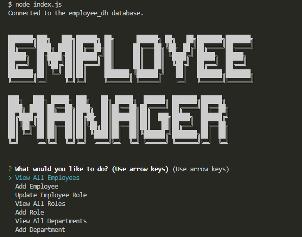

 # Employee Tracker

## Description

This is a command line app that allows you to track/update employees in a company. By making use of node, inquirer, and mysql2, the user is able to choose various different options to view different employees and departments. Upon starting the app, the user is able to view all roles, departments, employees, add to any one of those, and additionally manually update the role of any employee.

## Table of Contents

- [Installation](#installation)
- [Usage](#usage)
- [Credits](#credits)
- [License](#license)
- [Questions](#questions)

## Installation

Clone the repository. Run npm install within the console to install the correct dependencies required. Once that is done, you will need the database to be created and seeded. Assuming you have mysql, you are able to run mysql -u root -p, and then type your password to start mysql in the command line. You can then enter SOURCE ./db/schema.sql, and then  SOURCE ./db/seeds.sql to initialize and populate the database. Once you have completed this, you can run node index.js to begin the app. Since this is within the command line, you will need to use arrow keys along with enter to go through the menu.

## Usage

For a walkthrough video on using the app, please visit this link! 

https://drive.google.com/file/d/1py_7DtZC5YtToYPC-FKNHsbV6Yq3Jihb/view?usp=sharing

## Credits

N/A

## License

This project is licensed under the MIT license. License link: https://opensource.org/license/mit/

## Questions

You can see below to reach me for any questions you have regarding the project.

https://github.com/rb2277

